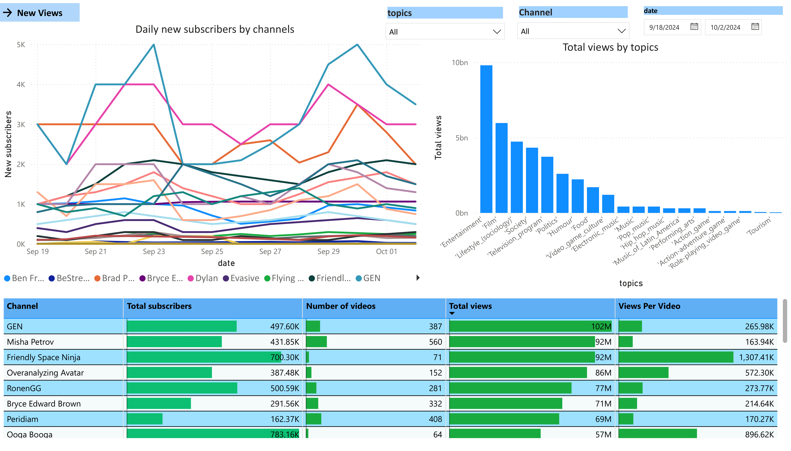

 
 
 

<h1 align="center">TubeTracker</h1>

  TubeTracker is a project that extracts YouTube channel data from my account using the YouTube API to monitor changes in views, subscribers, and overall video performance.
  The script collects daily metrics for each channel over a two-week period and visualizes the results using Power BI. [Download Power BI Dashboard](https://github.com/romisadeh/tube-tracker/raw/main/assets/youtube_data.pbix)

## Key Insights:
- **Daily New Views**: Track the change in views for each channel on a daily basis.
- **Daily New Subscribers**: Monitor subscriber growth, broken down by channel.
- **Total Views by Topics**: Analyze total views categorized by specific channel topics.
- **Comprehensive Data Table**: A detailed table of all metrics, offering an in-depth view for analysis.

This project enables a clear understanding of how each channel is performing over time, providing data-driven insights for further evaluation.

## TubeTracker BI dashboard:
Power BI dashboard visualizing the data extracted from youtube api 

