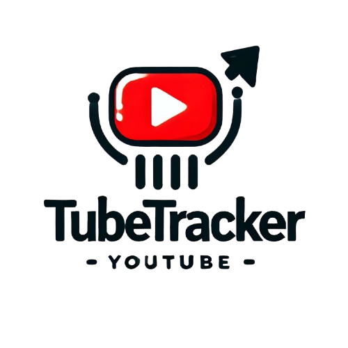
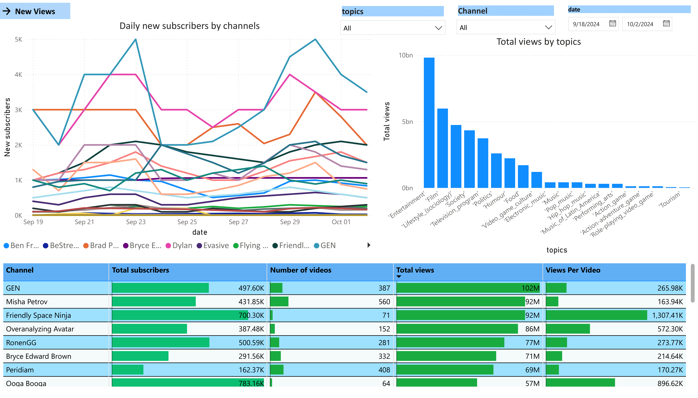
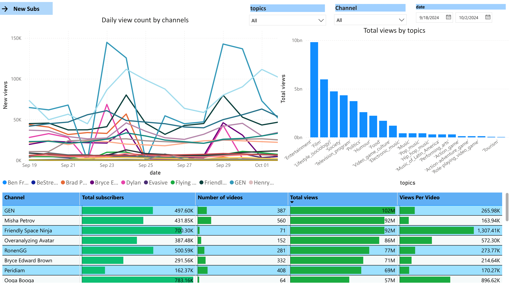

 
 
 

<h1 align="center">TubeTracker</h1>

  TubeTracker is a project that extracts YouTube channel data from my account using the YouTube API to monitor changes in views, subscribers, and overall video performance.
  The script collects daily metrics for each channel over a two-week period and visualizes the results using Power BI.

  <a href="https://app.powerbi.com/links/tJZEOR0q87?ctid=784e25d3-aacb-40f0-adae-a1537ab168e5&pbi_source=linkShare&bookmarkGuid=063f3df0-4e14-43aa-a164-613324bfcdbd"> Go to dashboard</a> 
  <a href="https://github.com/romisadeh/tube-tracker/blob/main/assets/youtube_data.pbix" download>Download Dashboard</a>

## Key Insights:
- **Daily New Views**: Track the change in views for each channel on a daily basis.
- **Daily New Subscribers**: Monitor subscriber growth, broken down by channel.
- **Total Views by Topics**: Analyze total views categorized by specific channel topics.
- **Comprehensive Data Table**: A detailed table of all metrics, offering an in-depth view for analysis.

This project enables a clear understanding of how each channel is performing over time, providing data-driven insights for further evaluation.

## TubeTracker BI dashboard:
The script create a [csv file](https://github.com/romisadeh/tube-tracker/blob/main/assets/youtube_api.csv) that later is entered to Power BI to create a visualized dashboard  
 
  

## Requierments:
-googleapiclient.discovery   
-google_auth_oauthlib.flow  
-pickle  
-google.auth.transport.requests  

## Quick start:
To run code user must first get youtube scope, client secret and client secret's JOIN file.  
Enter [Google For Developers](https://developers.google.com/youtube/v3) and create app.  
download JSON file and put the information into a text file name "youtube_data" in the correct order:  
1. scopes  
2. client secret  

run the code to create a csv file with all the data  
